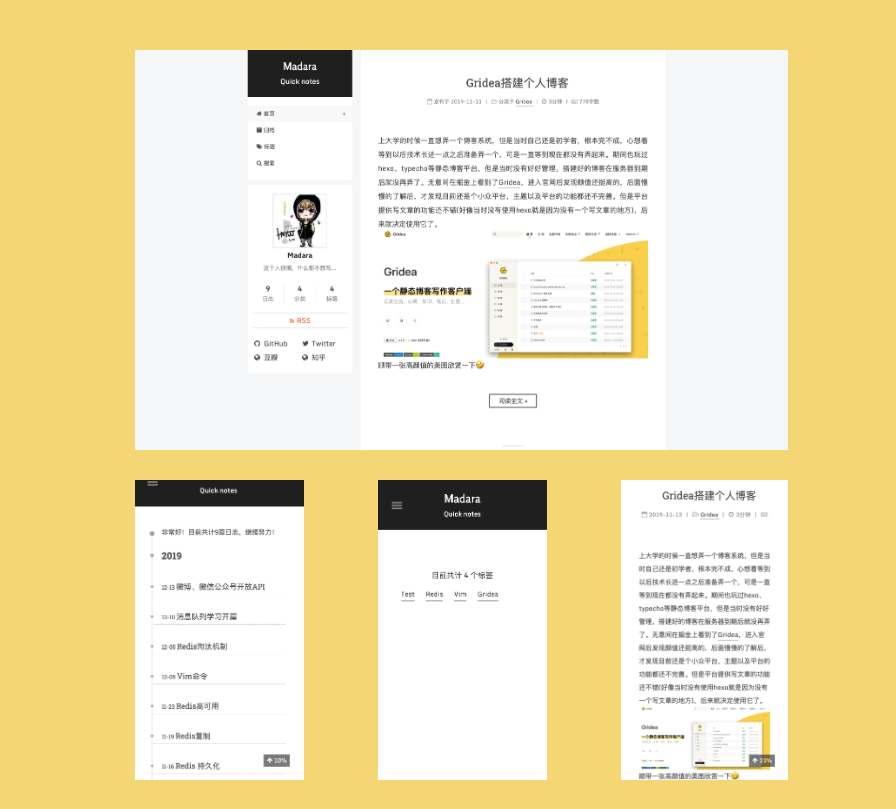

<h1 align="center">
  Gridea NexT Theme
</h1>



Next主题原本是Hexo平台上一款火爆的主题，该主题的主要设计风格就是简约，深受大众喜爱，当然我也很喜欢这款主题，最近自己在搭建静态博客，但是选择的是Gridea，目前来说还是一款小众平台提供的主题非常有限，翻了Gridea上所有的主题，还是比较喜欢NexT，最终决定还是自己开发并维护一套主题，方便自己也方便他人，如果想了解更多关于gridea-theme-next的信息[请移步这里](https://hsxyhao.github.io/post/shuo-yi-xia-next-zhu-ti/)。

### 使用

先配置好[Gridea环境](https://gridea.dev/docs/)([v0.8.3以上](https://github.com/getgridea/gridea/releases))，配置教程请[移步这里](https://hsxyhao.github.io/post/gridea-setup/)
1. mac/linux系统
```java
// gridea主题的目录可能不一样，真实路径为gridea后台的系统配置>源文件夹中的路径
cd ~/Documents/Gridea/themes
git clone https://github.com/hsxyhao/gridea-theme-next

```
下载好之后，进入后台的主题配置里配置一下就行了

2. window系统
> 将下载好的主题包拷贝进gridea的主题目录
### 已更新内容

- [x] 首页、归档、标签、分页、目录
- [x] 主题入场动画
- [x] 标签分权重展示
- [x] 添加博客阅读页页脚
- [x] 自定义markdown样式
- [x] 支持KaTex数学公式
- [x] 自定义布局(部分支持)
- [x] hexo-next多种scheme开发
- [x] 主题兼容模式
- [x] 添加国内外主流社交账号

### 后续版本更新
- [ ] 站内搜索(站内搜索功能需要等到Gridea支持插件版本才可以实现)
- [ ] 友情链接
- [ ] 夜间模式
- [ ] 打赏功能
> 当前最新版本为beta版本，本来准备更新完发布，但是就在昨天我竟然被“催更”了😂，所以就准备提前更新了

### 建议
在使用主题时，建议大家把md文件的排版弄好，不然会渲染的很糟心，目前next版本一直是0.0.1，处于不稳定版本，所以更新会比较频繁，有什么问题直接反馈，会尽快回复，感谢支持。

### 联系
欢迎联系，一起交流学习
+ QQ：806649821
+ VX：wh806649821 (备注next)

### 最后
对于一名后端开发来说写到这里着实不易，虽然技术栈、代码优化、用户体验这些都做的不是很好，但是会慢慢改进，如果觉得不错可以start支持一下，每一个start都是我持续更新的动力。
