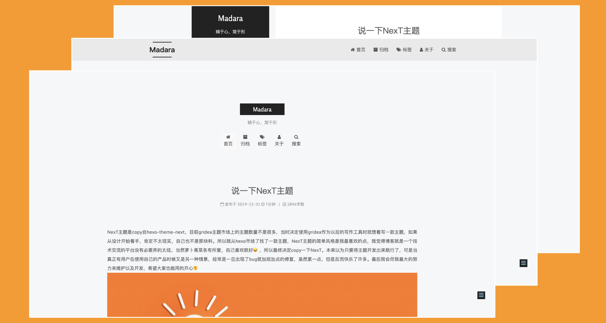

<h1 align="center">
  Gridea Theme NexT
</h1>

### 使用
下载主题压缩包至gridea主题包中，在主题包文件夹下解压，并将其文件名改为next，主题包路径可以在gridea站点源文件夹中找到。

### 更新
更新之前需要先备份旧的next主题assets/media路径下的images文件，下载最新版主题压缩包，并将其解压至gridea主题包中，最后将备份的images文件迁移回assets/media下。（如果旧版本next主题中不包含images可忽略备份操作）

### 主题介绍
gridea-theme-next原产自hexo平台的next主题，将其搬至gridea，也算是为gridea开源社区做一份贡献。主题目前包含以下功能：自定义主题色，搜索功能，主题魔改功能，自定义鼠标样式，看板娘，背景音乐（外链以及aplayer），支持CDN，valine（1.4版本）评论，谷歌、百度站点分析，以及其他常用自定义配置等功能。

### 计划更新
- [ ] 夜间模式
- [ ] 打赏功能
- [ ] 多语言支持

### Valine邮件支持
新版本中作者将邮件通知功能移除，所以要想实现评论邮件通知，需要借助第三方支持，具体操作步骤，可以参考[Valine-Admin](https://github.com/zhaojun1998/Valine-Admin)

### 自定义配置保存
windows用户如果上传了背景图片，会导致之后整个配置无法保存，这里不建议windows用户上传背景图片。但是可以选择手动填写图片地址的兼容方案，目前手动填写可以是图片外链，也可以是本地图片。如果是本地图片的话需要将图片先复制到next主题下assets/media/images这个目录，如果没有images文件夹，手动创建一个，然后再配置项那里填写成/media/images/文件名。

[手动填写操作步骤](https://cdn.jsdelivr.net/gh/o1f/i@master/2020/04/11/2U2OBqTR.gif)

### 最后
在这里祝大家2020年新的一年里开心每一天，感觉不错的话，点赞支持一下呗！

### 联系

