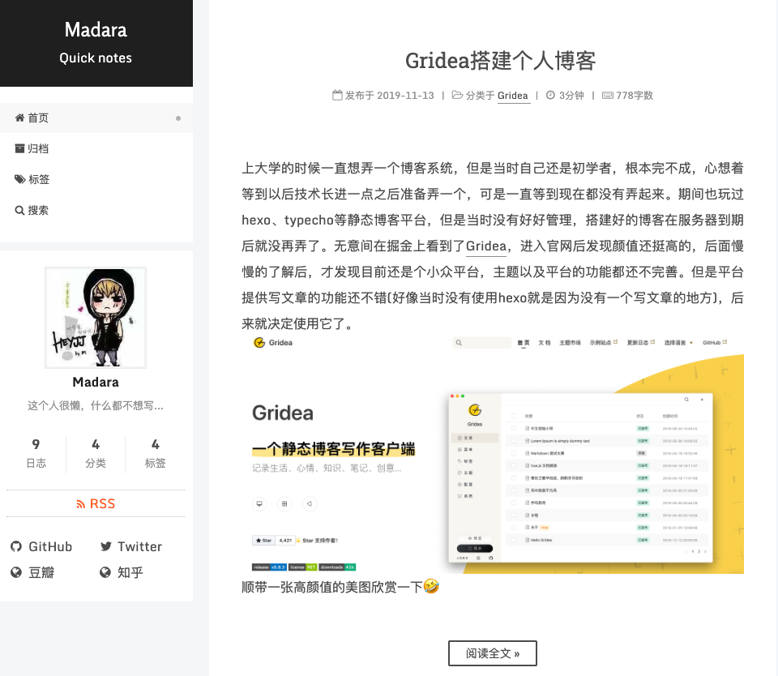

<h1 align="center">
  Gridea NexT Theme
</h1>

### 介绍
Next主题原本是Hexo平台上一款火爆的主题，该主题的主要设计风格就是简约，深受大众喜爱，当然我也很喜欢这款主题，最近自己在搭建静态博客，但是选择的是Gridea，目前来说还是一款小众平台提供的主题非常有限，翻了Gridea上所有的主题，还是比较喜欢NexT，最终决定还是自己开发并维护一套主题，方便自己也方便他人。



### 使用
先配置好[Gridea环境](https://gridea.dev/docs/)，配置教程请[移步这里](https://hsxyhao.github.io/post/gridea-setup/)
```java
// gridea主题的目录可能不一样，真实路径为gridea后台的系统配置>源文件夹中的路径
cd ~/Documents/Gridea/themes
git clone https://github.com/hsxyhao/gridea-theme-next

```
下载好之后，进入后台的主题配置里配置一下就行了

### 已更新内容

- [x] 首页
- [x] 归档
- [x] 标签
- [x] 分页
- [x] 目录

### 后续版本更新
- [ ] 站内搜索
- [ ] 添加博客阅读页页脚
- [ ] 主题入场动画
- [ ] 标签分权重展示
- [ ] 关于我页面
- [ ] 自定义markdown样式

### 联系
QQ：806649821
VX：wh806649821 (备注next)

### 截图

### 最后
对于一名后端开发来说写到这里着实不易，虽然技术栈、代码优化、用户体验这些都做的不是很好，但是会慢慢改进。
